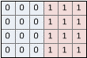

# D3D12_VIDEO_FRAME_STEREO_FORMAT enumeration

## -description

Defines the layout in memory of a stereo 3D video frame. All drivers that support stereo must support all of the defined formats.

## -enum-fields

### -field D3D12_VIDEO_FRAME_STEREO_FORMAT_NONE 

No stereo format is specified.

### -field D3D12_VIDEO_FRAME_STEREO_FORMAT_MONO 

The sample does not contain stereo data. If the stereo format is not specified, this value is the default.

### -field D3D12_VIDEO_FRAME_STEREO_FORMAT_HORIZONTAL 

Frame 0 and frame 1 are packed side-by-side, as shown in the following diagram.

### -field D3D12_VIDEO_FRAME_STEREO_FORMAT_VERTICAL 

Frame 0 and frame 1 are packed top-to-bottom, as shown in the following diagram.

### -field D3D12_VIDEO_FRAME_STEREO_FORMAT_SEPARATE 

Frame 0 and frame 1 are placed in separate resources

## -remarks

## -see-also

