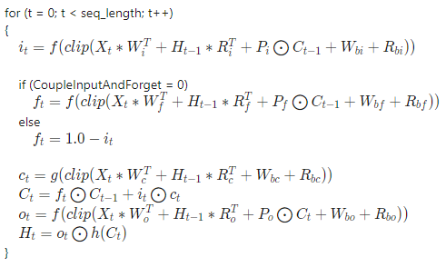
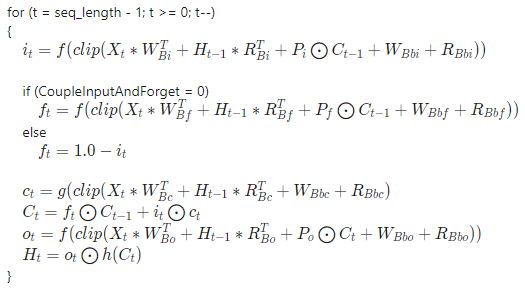

## -description

Performs a one-layer long short term memory (LSTM) function on the input. This operator uses multiple gates to perform this layer. These gates are performed multiple times in a loop, dictated by the sequence length dimension and the *SequenceLengthsTensor*.

### Equation for the forward direction

### Equation for the backward direction

### Equation legend

## -struct-fields

### -field InputTensor

Type: **const [DML_TENSOR_DESC](/windows/win32/api/directml/ns-directml-dml_tensor_desc)\***

A tensor containing the input data, X. Packed (and potentially padded) into one 4-D tensor with the sizes of `{ 1, seq_length, batch_size, input_size }`. seq_length is the dimension that is mapped to the index, t. The tensor doesn't support the **DML_TENSOR_FLAG_OWNED_BY_DML** flag.

### -field WeightTensor

Type: **const [DML_TENSOR_DESC](/windows/win32/api/directml/ns-directml-dml_tensor_desc)\***

A tensor containing the weight data, W. Concatenation of W_[iofc] and W_B[iofc] (if bidirectional). The tensor has sizes `{ 1, num_directions, 4 * hidden_size, input_size }`. The tensor doesn't support the **DML_TENSOR_FLAG_OWNED_BY_DML** flag.

### -field RecurrenceTensor

Type: **const [DML_TENSOR_DESC](/windows/win32/api/directml/ns-directml-dml_tensor_desc)\***

A tensor containing the recurrence data, R. Concatenation of R_[iofc] and R_B[iofc] (if bidirectional). This tensor has sizes `{ 1, num_directions, 4 * hidden_size, hidden_size }`. The tensor doesn't support the **DML_TENSOR_FLAG_OWNED_BY_DML** flag.

### -field BiasTensor

Type: \_Maybenull\_ **const [DML_TENSOR_DESC](/windows/win32/api/directml/ns-directml-dml_tensor_desc)\***

An optional tensor containing the bias data, B. Concatenation of `{ W_b[iofc], R_b[iofc] }`, and `{ W_Bb[iofc], R_Bb[iofc] }` (if bidirectional). This tensor has sizes `{ 1, 1, num_directions, 8 * hidden_size }`. If not specified, then defaults to 0 bias. The tensor doesn't support the **DML_TENSOR_FLAG_OWNED_BY_DML** flag.

### -field HiddenInitTensor

Type: \_Maybenull\_ **const [DML_TENSOR_DESC](/windows/win32/api/directml/ns-directml-dml_tensor_desc)\***

An optional tensor containing the hidden node initializer data, H_(t-1). Contents of this tensor are only used on the first loop index t. If not specified, then defaults to 0. This tensor has sizes `{ 1, num_directions, batch_size, hidden_size }`. The tensor doesn't support the **DML_TENSOR_FLAG_OWNED_BY_DML** flag.

### -field CellMemInitTensor

Type: \_Maybenull\_ **const [DML_TENSOR_DESC](/windows/win32/api/directml/ns-directml-dml_tensor_desc)\***

An optional tensor containing the cell initializer data, C_(t-1). Contents of this tensor are only used on the first loop index t. If not specified, then defaults to 0. This tensor has sizes `{ 1, num_directions, batch_size, hidden_size }`. The tensor doesn't support the **DML_TENSOR_FLAG_OWNED_BY_DML** flag.

### -field SequenceLengthsTensor

Type: \_Maybenull\_ **const [DML_TENSOR_DESC](/windows/win32/api/directml/ns-directml-dml_tensor_desc)\***

An optional tensor containing an independent seq_length for each element in the batch. If not specified, then all sequences in the batch have length seq_length. This tensor has sizes `{ 1, 1, 1, batch_size }`. The tensor doesn't support the **DML_TENSOR_FLAG_OWNED_BY_DML** flag.

### -field PeepholeTensor

Type: \_Maybenull\_ **const [DML_TENSOR_DESC](/windows/win32/api/directml/ns-directml-dml_tensor_desc)\***

An optional tensor containing the weight data for peepholes, P. If not specified, then defaults to 0. Concatenation of P_[iof] and P_B[iof] (if bidirectional). This tensor has sizes `{ 1, 1, num_directions, 3 * hidden_size }`. The tensor doesn't support the **DML_TENSOR_FLAG_OWNED_BY_DML** flag.

### -field OutputSequenceTensor

Type: \_Maybenull\_ **const [DML_TENSOR_DESC](/windows/win32/api/directml/ns-directml-dml_tensor_desc)\***

An optional tensor with which to write the concatenation of all the intermediate output values of the hidden nodes, H_t. This tensor has sizes `{ seq_length, num_directions, batch_size, hidden_size }`. seq_length is mapped to the loop index t.

### -field OutputSingleTensor

Type: \_Maybenull\_ **const [DML_TENSOR_DESC](/windows/win32/api/directml/ns-directml-dml_tensor_desc)\***

An optional tensor with which to write the last output value of the hidden nodes, H_t. This tensor has sizes `{ 1, num_directions, batch_size, hidden_size }`.

### -field OutputCellSingleTensor

Type: \_Maybenull\_ **const [DML_TENSOR_DESC](/windows/win32/api/directml/ns-directml-dml_tensor_desc)\***

An optional tensor with which to write the last output value of the cell, C_t. This tensor has sizes `{ 1, num_directions, batch_size, hidden_size }`.

### -field ActivationDescCount

Type: [**UINT**](/windows/desktop/winprog/windows-data-types)

This field determines the size of the *ActivationDescs* array.

### -field ActivationDescs

Type: \_Field\_size\_(ActivationDescCount) **const [DML_OPERATOR_DESC](/windows/win32/api/directml/ns-directml-dml_operator_desc)\***

An array of [DML_OPERATOR_DESC](/windows/win32/api/directml/ns-directml-dml_operator_desc) containing the descriptions of the activation operators f(), g(), and h(). f(), g(), and h() are defined independently of direction, meaning that if [DML_RECURRENT_NETWORK_DIRECTION_FORWARD](/windows/win32/api/directml/ne-directml-dml_recurrent_network_direction) or **DML_RECURRENT_NETWORK_DIRECTION_BACKWARD** are supplied in *Direction*, then three activations must be provided. If **DML_RECURRENT_NETWORK_DIRECTION_BIDIRECTIONAL** is defined, then six activations must be provided. For bidirectional, activations must be provided f(), g(), and h() for forward followed by f(), g(), and h() for backwards.

### -field Direction

Type: **const [DML_RECURRENT_NETWORK_DIRECTION](/windows/win32/api/directml/ne-directml-dml_recurrent_network_direction)\***

The direction of the operator: forward, backward, or bidirectional.

### -field ClipThreshold

Type: <b>float</b>

The cell clip threshold. Clipping bounds the elements of a tensor in the range of [-`ClipThreshold`, +`ClipThreshold`], and is applied to the input of activations.

### -field UseClipThreshold

Type: <b><a href="/windows/desktop/WinProg/windows-data-types">BOOL</a></b>

**TRUE** if *ClipThreshold* should be used. Otherwise, **FALSE**.

### -field CoupleInputForget

Type: <b><a href="/windows/desktop/WinProg/windows-data-types">BOOL</a></b>

**TRUE** if the input and forget gates should be coupled. Otherwise, **FALSE**.

## Availability
This operator was introduced in `DML_FEATURE_LEVEL_1_0`.

## Tensor constraints
*BiasTensor*, *CellMemInitTensor*, *HiddenInitTensor*, *InputTensor*, *OutputCellSingleTensor*, *OutputSequenceTensor*, *OutputSingleTensor*, *PeepholeTensor*, *RecurrenceTensor*, and *WeightTensor* must have the same *DataType*.

## Tensor support
| Tensor | Kind | Supported dimension counts | Supported data types |
| ------ | ---- | -------------------------- | -------------------- |
| InputTensor | Input | 4 | FLOAT32, FLOAT16 |
| WeightTensor | Input | 4 | FLOAT32, FLOAT16 |
| RecurrenceTensor | Input | 4 | FLOAT32, FLOAT16 |
| BiasTensor | Optional input | 4 | FLOAT32, FLOAT16 |
| HiddenInitTensor | Optional input | 4 | FLOAT32, FLOAT16 |
| CellMemInitTensor | Optional input | 4 | FLOAT32, FLOAT16 |
| SequenceLengthsTensor | Optional input | 4 | UINT32 |
| PeepholeTensor | Optional input | 4 | FLOAT32, FLOAT16 |
| OutputSequenceTensor | Optional output | 4 | FLOAT32, FLOAT16 |
| OutputSingleTensor | Optional output | 4 | FLOAT32, FLOAT16 |
| OutputCellSingleTensor | Optional output | 4 | FLOAT32, FLOAT16 |
