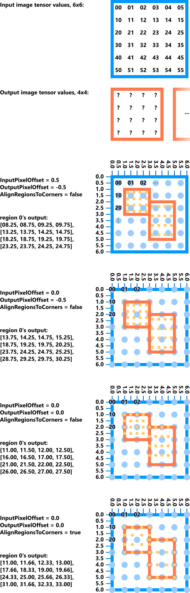

## -description

Performs an ROI align operation, as described in the [Mask R-CNN](https://arxiv.org/abs/1703.06870) paper. In summary, the operation extracts cropped windows from the input image tensor, and resizes them to a common output size specified by the last 2 dimensions of *OutputTensor* using the specified *InterpolationMode*.

The general logic is as follows.

```
for every region roiIndex
    outputSizeX = OutputTensor.Sizes[3]
    outputSizeY = OutputTensor.Sizes[2]
    scaledRegionX1 = ROITensor[roiIndex, 0] * SpatialScaleX
    scaledRegionY1 = ROITensor[roiIndex, 1] * SpatialScaleY
    scaledRegionX2 = ROITensor[roiIndex, 2] * SpatialScaleX
    scaledRegionY2 = ROITensor[roiIndex, 3] * SpatialScaleY
    scaledRegionSizeX = scaledRegionX2 - scaledRegionX1
    scaledRegionSizeY = scaledRegionY2 - scaledRegionY1
    inputSamplesPerOutputSampleX = clamp(scaledRegionSizeX / outputSizeX, MinimumSamplesPerOutput, MaximumSamplesPerOutput)
    inputSamplesPerOutputSampleY = clamp(scaledRegionSizeY / outputSizeY, MinimumSamplesPerOutput, MaximumSamplesPerOutput)
    outputSampleSizeX = outputSizeX * inputSamplesPerOutputSampleX
    outputSampleSizeY = outputSizeY * inputSamplesPerOutputSampleY
    outputSampleToInputScaleX = scaledRegionSizeX / outputSampleSizeX
    outputSampleToInputScaleY = scaledRegionSizeX / outputSampleSizeX

    compute all output values
endfor
```

Compute all the output values for the current region as follows.

```
for every output tensor element x y and channel in the region
    outputValue = getOutputValue(channel, outputTensorX, outputTensorY)
    OutputTensor[roiIndex, channel, outputTensorY, outputTensorX] = outputValue
endfor
```

Compute each input sample for the output element as follows.

```
outputTensorSampleX = outputTensorX * inputSamplesPerOutputSampleX
outputTensorSampleY = outputTensorY * inputSamplesPerOutputSampleY
outputValue = 0
for sampleX from outputTensorSampleX to <= outputTensorSampleX + inputSamplesPerOutputSampleX
    for sampleY from outputTensorSampleY to <= outputTensorSampleY + inputSamplesPerOutputSampleY
        inputTensorX = (sampleX - OutputPixelOffset) * outputSampleToInputScaleX + scaledRegionX1 - InputPixelOffset
        inputTensorY = (sampleY - OutputPixelOffset) * outputSampleToInputScaleY + scaledRegionY1 - InputPixelOffset
        inputValue = interpolate2D(InputTensor, BatchIndicesTensor[roiIndex], channel, inputTensorX, inputTensorY)
        outputValue = either average or maximum with inputValue
    endfor
endfor
return outputValue
```

## Examples



## -struct-fields

### -field InputTensor

Type: **const [DML_TENSOR_DESC](/windows/win32/api/directml/ns-directml-dml_tensor_desc)\***

A tensor containing the input data with dimensions `{ BatchCount, ChannelCount, InputHeight, InputWidth }`.

### -field ROITensor

Type: **const [DML_TENSOR_DESC](/windows/win32/api/directml/ns-directml-dml_tensor_desc)\***

A tensor containing the regions of interest (ROI) data, a series of bounding boxes in floating-point coordinates that point into the X and Y dimensions of the input tensor. The allowed dimensions of *ROITensor* are `{ NumROIs, 4 }`, `{ 1, NumROIs, 4 }`, or `{ 1, 1, NumROIs, 4 }`. For each ROI, the values will be the coordinates of its top-left and bottom-right corners in the order `[x1, y1, x2, y2]`. Regions can be empty, meaning that all output pixels come from the single input coordinate, and regions can be inverted (for example, x2 less than x1), meaning that the output receives a mirrored/flipped version of the input. These coordinates are first scaled by *SpatialScaleX* and *SpatialScaleY*, but if they are both 1.0, then the region rectangles simply correspond directly to the input tensor coordinates.

### -field BatchIndicesTensor

Type: **const [DML_TENSOR_DESC](/windows/win32/api/directml/ns-directml-dml_tensor_desc)\***

A tensor containing the batch indices to extract the ROIs from. The allowed dimensions of *BatchIndicesTensor* are `{ NumROIs }`, `{ 1, NumROIs }`, `{ 1, 1, NumROIs }`, or `{ 1, 1, 1, NumROIs }`. Each value is the index of a batch from *InputTensor*. The behavior is undefined if the values are not in the range `[0, BatchCount)`.

### -field OutputTensor

Type: **const [DML_TENSOR_DESC](/windows/win32/api/directml/ns-directml-dml_tensor_desc)\***

A tensor containing the output data. The expected dimensions of *OutputTensor* are `{ NumROIs, ChannelCount, OutputHeight, OutputWidth }`.

### -field ReductionFunction

Type: **[DML_REDUCE_FUNCTION](/windows/win32/api/directml/ne-directml-dml_reduce_function)**

The reduction function to use when reducing across all input samples that contribute to an output element (**DML_REDUCE_FUNCTION_AVERAGE** or **DML_REDUCE_FUNCTION_MAX**). The number of input samples to reduce across is bounded by *MinimumSamplesPerOutput* and *MaximumSamplesPerOutput*.

### -field InterpolationMode

Type: **[DML_INTERPOLATION_MODE](/windows/win32/api/directml/ne-directml-dml_interpolation_mode)**

The interpolation mode to use when resizing the regions.

* **DML_INTERPOLATION_MODE_NEAREST_NEIGHBOR**. Uses the *nearest nighbor* algorithm, which chooses the input element nearest to the corresponding pixel center for each output element.
* **DML_INTERPOLATION_MODE_LINEAR**. Uses the *bilinear* algorithm, which computes the output element by doing the weighted average of the 2 nearest neighboring input elements per dimension. Since only 2 dimensions are resized, the weighted average is computed on a total of 4 input elements for each output element.

### -field SpatialScaleX

Type: **[FLOAT](/windows/desktop/WinProg/windows-data-types)**

The X (or width) component of the scaling factor to multiply the *ROITensor* coordinates by in order to make them proportionate to *InputHeight* and *InputWidth*. For example, if *ROITensor* contains normalized coordinates (values in the range `[0..1]`), then *SpatialScaleX* would usually have the same value as *InputWidth*.

### -field SpatialScaleY

Type: **[FLOAT](/windows/desktop/WinProg/windows-data-types)**

The Y (or height) component of the scaling factor to multiply the *ROITensor* coordinates by in order to make them proportionate to *InputHeight* and *InputWidth*. For example, if *ROITensor* contains normalized coordinates (values in the range `[0..1]`), then *SpatialScaleY* would usually have the same value as *InputHeight*.

### -field InputPixelOffset

Type: **[FLOAT](/windows/desktop/WinProg/windows-data-types)**

The offset from `(0,0)` of the input coordinates to the top-left pixel center, typically either 0 or 0.5. When this value is 0, the top-left corner of the pixel is used instead of its center, which usually won't give the expected result, but is useful for compatibility with some frameworks. When this value is 0.5, pixels are treated as being at the center, which is the same behavior as [DML_ROI_ALIGN_OPERATOR_DESC](ns-directml-dml_roi_align_operator_desc.md).

### -field OutputPixelOffset

Type: **[FLOAT](/windows/desktop/WinProg/windows-data-types)**

The offset from the top-left pixel center to `(0,0)` of the output coordinates, typically either 0 or -0.5. When this value is 0, the top-left corner of the pixel is used instead of its center, which usually won't give the expected result, but is useful for compatibility with some frameworks. When this value is -0.5, pixels are treated as being at the center, which is the same behavior as [DML_ROI_ALIGN_OPERATOR_DESC](ns-directml-dml_roi_align_operator_desc.md).

### -field OutOfBoundsInputValue

Type: **[FLOAT](/windows/desktop/WinProg/windows-data-types)**

The value to read from *InputTensor* when the ROIs are outside the bounds of *InputTensor*. This can happen when the values obtained after scaling *ROITensor* by *SpatialScaleX* and *SpatialScaleY* are bigger than *InputWidth* and *InputHeight*.

### -field MinimumSamplesPerOutput

Type: **[UINT](/windows/desktop/WinProg/windows-data-types)**

The minimum number of input samples to use for every output element. The operator will calculate the number of input samples by doing *ScaledCropSize* / *OutputSize*, and then clamping it to *MinimumSamplesPerOutput* and *MaximumSamplesPerOutput*.

### -field MaximumSamplesPerOutput

Type: **[UINT](/windows/desktop/WinProg/windows-data-types)**

The maximum number of input samples to use for every output element. The operator will calculate the number of input samples by doing *ScaledCropSize* / *OutputSize*, and then clamping it to *MinimumSamplesPerOutput* and *MaximumSamplesPerOutput*.

### -field AlignRegionsToCorners

Type: **[BOOL](/windows/desktop/WinProg/windows-data-types)**

The output sample points in each region should be stretched out to the very corners of the region rather than evenly spread within the region. The default value is **FALSE**, which is the same behavior as [DML_ROI_ALIGN_OPERATOR_DESC](ns-directml-dml_roi_align_operator_desc.md).

## -remarks

## Availability
This operator was introduced in **DML_FEATURE_LEVEL_4_0**.

## Tensor constraints
*InputTensor*, *OutputTensor*, and *ROITensor* must have the same *DataType*.

## Tensor support
### DML_FEATURE_LEVEL_5_0 and above
| Tensor | Kind | Supported dimension counts | Supported data types |
| ------ | ---- | -------------------------- | -------------------- |
| InputTensor | Input | 4 | FLOAT32, FLOAT16 |
| ROITensor | Input | 2 to 4 | FLOAT32, FLOAT16 |
| BatchIndicesTensor | Input | 1 to 4 | UINT64, UINT32 |
| OutputTensor | Output | 4 | FLOAT32, FLOAT16 |

### DML_FEATURE_LEVEL_4_0 and above
| Tensor | Kind | Supported dimension counts | Supported data types |
| ------ | ---- | -------------------------- | -------------------- |
| InputTensor | Input | 4 | FLOAT32, FLOAT16 |
| ROITensor | Input | 2 to 4 | FLOAT32, FLOAT16 |
| BatchIndicesTensor | Input | 1 to 4 | UINT32 |
| OutputTensor | Output | 4 | FLOAT32, FLOAT16 |

## -see-also
