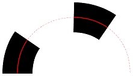
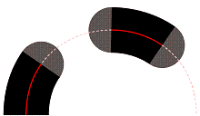
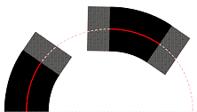
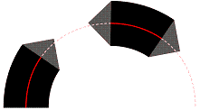

# XPS_DASH_CAP enumeration

## -description

Specifies the style of a dash cap  on a dashed stroke.

## -enum-fields

### -field XPS_DASH_CAP_FLAT:1

Flat-line cap.

### -field XPS_DASH_CAP_ROUND

Round-line cap.

### -field XPS_DASH_CAP_SQUARE

Square-line cap.

### -field XPS_DASH_CAP_TRIANGLE

Triangular-line cap.

## -remarks

In the following illustrations, each shaded area represents the dash cap that corresponds to each  type of <b>XPS_DASH_CAP</b>.

<table>
<tr>
<th>Value</th>
<th>Example</th>
</tr>
<tr>
<td>XPS_DASH_CAP_FLAT</td>
<td></td>
</tr>
<tr>
<td>XPS_DASH_CAP_ROUND</td>
<td></td>
</tr>
<tr>
<td>XPS_DASH_CAP_SQUARE</td>
<td></td>
</tr>
<tr>
<td>XPS_DASH_CAP_TRIANGLE</td>
<td></td>
</tr>
</table>

## -see-also

<a href="https://www.ecma-international.org/activities/XML%20Paper%20Specification/XPS%20Standard%20WD%201.6.pdf">XML Paper Specification</a>

