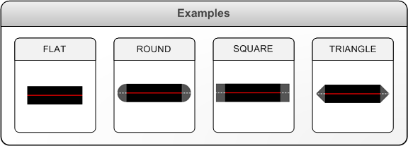

# XPS_LINE_CAP enumeration

## -description

Specifies the shapes of line segment caps.

## -enum-fields

### -field XPS_LINE_CAP_FLAT:1

Flat line cap.

### -field XPS_LINE_CAP_ROUND

Round line cap.

### -field XPS_LINE_CAP_SQUARE

Square line cap.

### -field XPS_LINE_CAP_TRIANGLE

Triangular line cap.

## -remarks

In the illustration that follows, the  shaded area at the end of each line segment  shows  the  cap that  is added to the line segment  depending on the    value  of <b>XPS_LINE_CAP</b>.

## -see-also

<a href="https://www.ecma-international.org/activities/XML%20Paper%20Specification/XPS%20Standard%20WD%201.6.pdf">XML Paper Specification</a>

