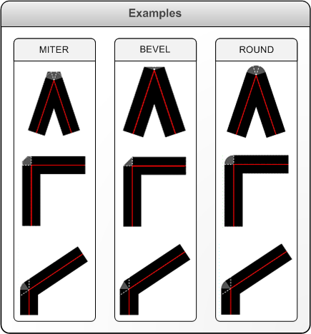

# XPS_LINE_JOIN enumeration

## -description

Describes the joint made by two intersecting line segments.

## -enum-fields

### -field XPS_LINE_JOIN_MITER:1

Produces a sharp or clipped corner, depending on whether the length of the miter exceeds the miter limit.

### -field XPS_LINE_JOIN_BEVEL

Produces a diagonal corner.

### -field XPS_LINE_JOIN_ROUND

Produces a smooth, circular arc between the lines.

## -remarks

In the illustration that follows, the shaded area at the vertex of the line segments in each  example shows how the joint fill is determined by the value of <b>XPS_LINE_JOIN</b>.

## -see-also

<a href="https://www.ecma-international.org/activities/XML%20Paper%20Specification/XPS%20Standard%20WD%201.6.pdf">XML Paper Specification</a>

