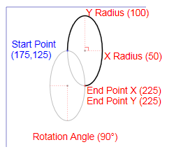
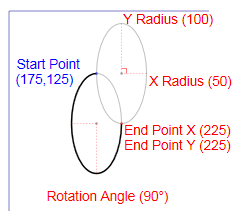
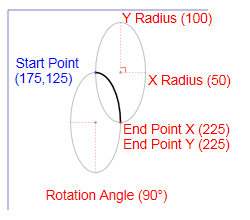
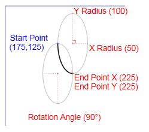
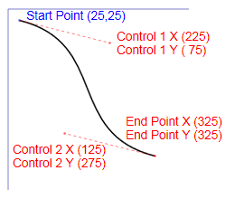
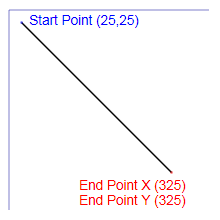
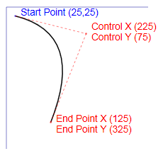

# XPS_SEGMENT_TYPE enumeration

## -description

Describes a line segment.

## -enum-fields

### -field XPS_SEGMENT_TYPE_ARC_LARGE_CLOCKWISE:1

The line segment is an arc that covers more than 180 degrees and is drawn in a clockwise direction from the start point to the end point.

### -field XPS_SEGMENT_TYPE_ARC_LARGE_COUNTERCLOCKWISE

The line segment is an arc that covers more than 180 degrees and is drawn in a counterclockwise direction from the start point to the end point.

### -field XPS_SEGMENT_TYPE_ARC_SMALL_CLOCKWISE

The line segment is an arc that covers at most 180 degrees and is drawn in a clockwise direction from the start point to the end point.

### -field XPS_SEGMENT_TYPE_ARC_SMALL_COUNTERCLOCKWISE

The line segment is an arc that covers at most 180 degrees and is drawn in a counterclockwise direction from the start point to the end point.

### -field XPS_SEGMENT_TYPE_BEZIER

The line segment is a cubic Bezier curve that is drawn between two points.

### -field XPS_SEGMENT_TYPE_LINE

The line segment is a straight line that is drawn between two points.

### -field XPS_SEGMENT_TYPE_QUADRATIC_BEZIER

The line segment is a quadratic Bezier curve that is drawn between two points.

## -remarks

A geometry segment is described by the start point, the segment type, and additional parameters whose values are determined by the segment type. The coordinates for the start point of the first segment are a property of the geometry figure. The start point of each subsequent segment is the end point of the preceding segment.

The table that follows shows an example of each segment type.

<table>
<tr>
<th colspan="2">Examples</th>
</tr>
<tr>
<td>
XPS_SEGMENT_TYPE_ARC_LARGE_CLOCKWISE 

</td>
<td>
XPS_SEGMENT_TYPE_ARC_LARGE_COUNTERCLOCKWISE  

</td>
</tr>
<tr>
<td>
XPS_SEGMENT_TYPE_ARC_SMALL_CLOCKWISE 

</td>
<td>
XPS_SEGMENT_TYPE_ARC_SMALL_COUNTERCLOCKWISE  

</td>
</tr>
<tr>
<td>
XPS_SEGMENT_TYPE_BEZIER  

</td>
<td>
  XPS_SEGMENT_TYPE_LINE  

</td>
</tr>
<tr>
<td>
XPS_SEGMENT_TYPE_QUADRATIC_BEZIER  

</td>
<td></td>
</tr>
</table>

## -see-also

<a href="https://www.ecma-international.org/activities/XML%20Paper%20Specification/XPS%20Standard%20WD%201.6.pdf">XML Paper Specification</a>

