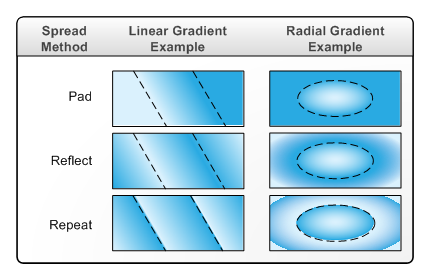

# XPS_SPREAD_METHOD enumeration

## -description

Describes how the spread region is  to be filled. 
 The spread region is the area that falls within the drawing area but outside of the gradient region.

## -enum-fields

### -field XPS_SPREAD_METHOD_PAD:1

The spread region is filled with the color whose value equals the color  at the end of the gradient region.

### -field XPS_SPREAD_METHOD_REFLECT

The spread region is filled by repeating the alternating reflection of the gradient that is  inside the gradient region.

### -field XPS_SPREAD_METHOD_REPEAT

The spread region is filled by repeating the gradient that is inside the gradient region, in the same orientation and direction.

## -remarks

The following illustration shows the effect of the spread methods on gradients that are drawn by using the <a href="/windows/desktop/api/xpsobjectmodel/nn-xpsobjectmodel-ixpsomlineargradientbrush">IXpsOMLinearGradientBrush</a> and <a href="/windows/desktop/api/xpsobjectmodel/nn-xpsobjectmodel-ixpsomradialgradientbrush">IXpsOMRadialGradientBrush</a> interfaces. The gradient region of an <b>IXpsOMLinearGradientBrush</b> interface is defined by calling the <a href="/windows/desktop/api/xpsobjectmodel/nf-xpsobjectmodel-ixpsomlineargradientbrush-setstartpoint">SetStartPoint</a> and <a href="/windows/desktop/api/xpsobjectmodel/nf-xpsobjectmodel-ixpsomlineargradientbrush-setendpoint">SetEndPoint</a> methods; the gradient region of an  <b>IXpsOMRadialGradientBrush</b> interface is defined by calling the <a href="/windows/desktop/api/xpsobjectmodel/nf-xpsobjectmodel-ixpsomradialgradientbrush-setcenter">SetCenter</a>, <a href="/windows/desktop/api/xpsobjectmodel/nf-xpsobjectmodel-ixpsomradialgradientbrush-setgradientorigin">SetGradientOrigin</a>, and <a href="/windows/desktop/api/xpsobjectmodel/nf-xpsobjectmodel-ixpsomradialgradientbrush-setradiisizes">SetRadiiSizes</a>  methods.     The gradient region is the area inside the dashed lines, and the spread area is the area outside of the gradient region.

## -see-also

<a href="https://www.ecma-international.org/activities/XML%20Paper%20Specification/XPS%20Standard%20WD%201.6.pdf">XML Paper Specification</a>
