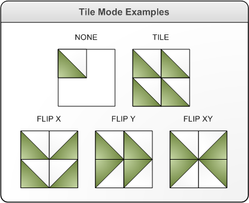

# XPS_TILE_MODE enumeration

## -description

Describes the tiling behavior of a tile brush.

## -enum-fields

### -field XPS_TILE_MODE_NONE:1

Only the base tile is drawn.

### -field XPS_TILE_MODE_TILE

First, the base tile is drawn. Next, the remaining area is filled by repeating the base tile such that the right edge of one tile is adjacent to the left edge of the next, and similarly for bottom and top.

### -field XPS_TILE_MODE_FLIPX

The same as <b>XPS_TILE_MODE_TILE</b>, but alternate columns of tiles are flipped horizontally.

### -field XPS_TILE_MODE_FLIPY

The same as <b>XPS_TILE_MODE_TILE</b>, but alternate rows of tiles are flipped vertically.

### -field XPS_TILE_MODE_FLIPXY

The combination of the effects produced by <b>XPS_TILE_MODE_FLIPX</b> and <b>XPS_TILE_MODE_FLIPY</b>.

## -remarks

The following illustration shows the effect of each tile mode on how a tiled brush fills the output area.

## -see-also

<a href="https://www.ecma-international.org/activities/XML%20Paper%20Specification/XPS%20Standard%20WD%201.6.pdf">XML Paper Specification</a>

