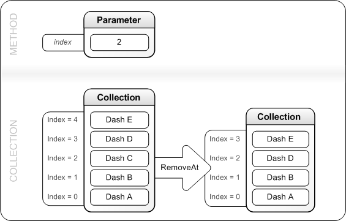

# IXpsOMDashCollection::RemoveAt

## -description

Removes and frees an <a href="/windows/win32/api/xpsobjectmodel/ns-xpsobjectmodel-xps_dash">XPS_DASH</a> structure from a specified location in the collection.

## -parameters

### -param index [in]

The zero-based index in the collection from which  an <a href="/windows/win32/api/xpsobjectmodel/ns-xpsobjectmodel-xps_dash">XPS_DASH</a> structure is to be removed and freed.

## -returns

If the method succeeds, it returns S_OK; otherwise, it returns an <b>HRESULT</b> error code.

## -remarks

This method removes and frees  the <a href="/windows/win32/api/xpsobjectmodel/ns-xpsobjectmodel-xps_dash">XPS_DASH</a> structure  referenced by the pointer at  the location specified by <i>index</i>. After freeing the structure, this method compacts the collection by   reducing by 1 the index of each pointer subsequent to <i>index</i>.

The figure that follows illustrates how the collection is changed by the <b>RemoveAt</b> method.

## -see-also

<a href="/windows/desktop/api/xpsobjectmodel/nn-xpsobjectmodel-ixpsomdashcollection">IXpsOMDashCollection</a>

<a href="https://en.wikipedia.org/wiki/Open_XML_Paper_Specification">XML Paper Specification</a>

<a href="/windows/win32/api/xpsobjectmodel/ns-xpsobjectmodel-xps_dash">XPS_DASH</a>