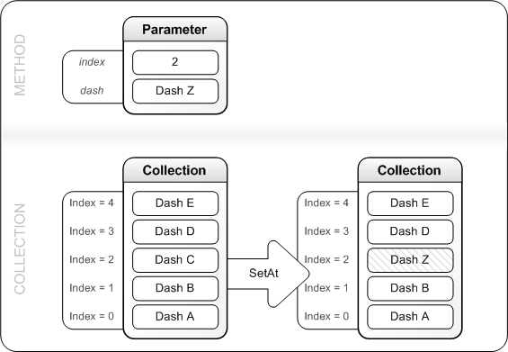

# IXpsOMDashCollection::SetAt

## -description

Replaces an <a href="/windows/win32/api/xpsobjectmodel/ns-xpsobjectmodel-xps_dash">XPS_DASH</a> structure at a specified location in the collection.

## -parameters

### -param index [in]

The zero-based index in the collection where an <a href="/windows/win32/api/xpsobjectmodel/ns-xpsobjectmodel-xps_dash">XPS_DASH</a> structure is to be replaced.

### -param dash [in]

A pointer to the <a href="/windows/win32/api/xpsobjectmodel/ns-xpsobjectmodel-xps_dash">XPS_DASH</a> structure that will replace the current contents at the location specified by <i>index</i>.

## -returns

If the method succeeds, it returns S_OK; otherwise, it returns an <b>HRESULT</b> error code.

## -remarks

At the location specified by <i>index</i>, this method frees the existing <a href="/windows/win32/api/xpsobjectmodel/ns-xpsobjectmodel-xps_dash">XPS_DASH</a> structure then replaces it with the structure that is passed in <i>dash</i>.

The figure that follows illustrates how the collection is changed by the <b>SetAt</b> method.

## -see-also

<a href="/windows/desktop/api/xpsobjectmodel/nn-xpsobjectmodel-ixpsomdashcollection">IXpsOMDashCollection</a>

<a href="https://en.wikipedia.org/wiki/Open_XML_Paper_Specification">XML Paper Specification</a>

<a href="/windows/win32/api/xpsobjectmodel/ns-xpsobjectmodel-xps_dash">XPS_DASH</a>