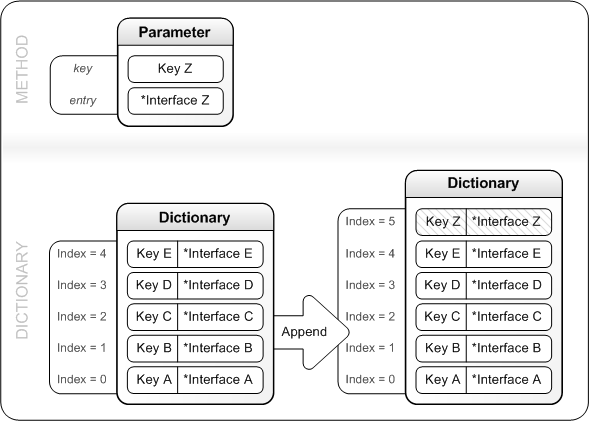

# IXpsOMDictionary::Append

## -description

Appends an <a href="/windows/desktop/api/xpsobjectmodel/nn-xpsobjectmodel-ixpsomshareable">IXpsOMShareable</a> interface along with its <i>key</i> to the end of the dictionary.

## -parameters

### -param key [in]

The key to be used for this entry.

The string referenced by <i>key</i> must be unique in the dictionary.

### -param entry [in]

A pointer to the <a href="/windows/desktop/api/xpsobjectmodel/nn-xpsobjectmodel-ixpsomshareable">IXpsOMShareable</a> interface that is to be appended  to the dictionary.

A dictionary cannot contain duplicate interface pointers. This parameter must contain an interface pointer that is not already in the dictionary.

## -returns

The method returns an <b>HRESULT</b>. Possible values include, but are not limited to, those in the table that follows. For information about  XPS document API return values that are not listed in this table, see <a href="/previous-versions/windows/desktop/dd372955(v=vs.85)">XPS Document Errors</a>.

<table>
<tr>
<th>Return code</th>
<th>Description</th>
</tr>
<tr>
<td width="40%">
<dl>
<dt><b>S_OK</b></dt>
</dl>
</td>
<td width="60%">
The method succeeded.

</td>
</tr>
<tr>
<td width="40%">
<dl>
<dt><b>XPS_E_NO_CUSTOM_OBJECTS</b></dt>
</dl>
</td>
<td width="60%">
<i>entry</i> does not point to a recognized interface implementation. Custom implementation of XPS Document API interfaces is not supported.

</td>
</tr>
</table>

## -remarks

The interface pointers stored in a dictionary will usually point to interfaces, such as <a href="/windows/desktop/api/xpsobjectmodel/nn-xpsobjectmodel-ixpsombrush">IXpsOMBrush</a>                 and <a href="/windows/desktop/api/xpsobjectmodel/nn-xpsobjectmodel-ixpsomvisual">IXpsOMVisual</a>, that are derived from the <a href="/windows/desktop/api/xpsobjectmodel/nn-xpsobjectmodel-ixpsomshareable">IXpsOMShareable</a> interface. To determine the interface type, call the <a href="/windows/desktop/api/xpsobjectmodel/nf-xpsobjectmodel-ixpsomshareable-gettype">IXpsOMShareable::GetType</a> method.

The figure that follows illustrates how the dictionary is changed by the <b>Append</b> method.

## -see-also

<a href="/windows/desktop/api/xpsobjectmodel/nn-xpsobjectmodel-ixpsombrush">IXpsOMBrush</a>

<a href="/windows/desktop/api/xpsobjectmodel/nn-xpsobjectmodel-ixpsomdictionary">IXpsOMDictionary</a>

<a href="/windows/desktop/api/xpsobjectmodel/nn-xpsobjectmodel-ixpsomshareable">IXpsOMShareable</a>

<a href="/windows/desktop/api/xpsobjectmodel/nn-xpsobjectmodel-ixpsomvisual">IXpsOMVisual</a>

<a href="https://en.wikipedia.org/wiki/Open_XML_Paper_Specification">XML Paper Specification</a>

<a href="/previous-versions/windows/desktop/dd372955(v=vs.85)">XPS Document Errors</a>