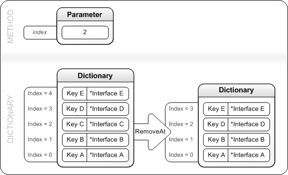

# IXpsOMDictionary::RemoveAt

## -description

Removes and releases the entry from a specified location in the dictionary.

## -parameters

### -param index [in]

The zero-based index in the dictionary from which  an entry is to be removed and released.

## -returns

If the method succeeds, it returns S_OK; otherwise, it returns an <b>HRESULT</b> error code.

## -remarks

At  the location specified by <i>index</i>, this method releases the interface  referenced by the pointer. After releasing the interface, this method compacts the dictionary by   reducing by 1 the index of each pointer subsequent to <i>index</i>.

The figure that follows illustrates how the dictionary is changed by the <b>RemoveAt</b> method.

## -see-also

<a href="/windows/desktop/api/xpsobjectmodel/nn-xpsobjectmodel-ixpsomdictionary">IXpsOMDictionary</a>

<a href="https://en.wikipedia.org/wiki/Open_XML_Paper_Specification">XML Paper Specification</a>