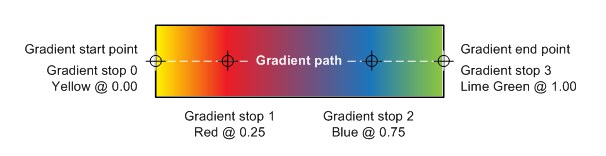
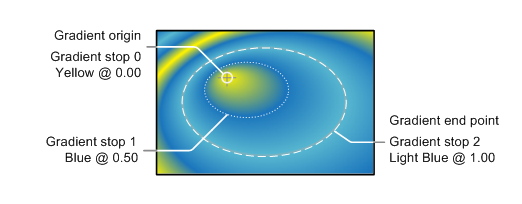

# IXpsOMGradientBrush::GetGradientStops

## -description

Gets a pointer to an <a href="/windows/desktop/api/xpsobjectmodel/nn-xpsobjectmodel-ixpsomgradientstopcollection">IXpsOMGradientStopCollection</a> interface that contains the collection of <a href="/windows/desktop/api/xpsobjectmodel/nn-xpsobjectmodel-ixpsomgradientstop">IXpsOMGradientStop</a> interfaces that define the gradient.

## -parameters

### -param gradientStops [out, retval]

A pointer to the <a href="/windows/desktop/api/xpsobjectmodel/nn-xpsobjectmodel-ixpsomgradientstopcollection">IXpsOMGradientStopCollection</a> interface that contains the collection of <a href="/windows/desktop/api/xpsobjectmodel/nn-xpsobjectmodel-ixpsomgradientstop">IXpsOMGradientStop</a> interfaces.

## -returns

The method returns an <b>HRESULT</b>. Possible values include, but are not limited to, those in the table that follows. For information about  XPS document API return values that are not listed in this table, see <a href="/previous-versions/windows/desktop/dd372955(v=vs.85)">XPS Document Errors</a>.

<table>
<tr>
<th>Return code</th>
<th>Description</th>
</tr>
<tr>
<td width="40%">
<dl>
<dt><b>S_OK</b></dt>
</dl>
</td>
<td width="60%">
The method succeeded.

</td>
</tr>
<tr>
<td width="40%">
<dl>
<dt><b>E_POINTER</b></dt>
</dl>
</td>
<td width="60%">
<i>gradientStops</i> is <b>NULL</b>.

</td>
</tr>
</table>

## -remarks

Gradient stops, which are  described  in the XPS OM by an <a href="/windows/desktop/api/xpsobjectmodel/nn-xpsobjectmodel-ixpsomgradientstop">IXpsOMGradientStop</a> interface, are used to define the color at a specific location along a gradient path; the color is interpolated between the gradient stops. The illustration that follows shows the gradient path and gradient stops of a linear gradient.

The illustration that follows shows the gradient stops of a radial gradient. In this example, the gradient region is the area enclosed by the outer ellipse, and the radial gradient is using the <b>XPS_SPREAD_METHOD_REFLECT</b> spread method to fill the space outside of the gradient region.

## -see-also

<a href="/windows/desktop/api/xpsobjectmodel/nn-xpsobjectmodel-ixpsomgradientbrush">IXpsOMGradientBrush</a>

<a href="/windows/desktop/api/xpsobjectmodel/nn-xpsobjectmodel-ixpsomgradientstop">IXpsOMGradientStop</a>

<a href="https://en.wikipedia.org/wiki/Open_XML_Paper_Specification">XML Paper Specification</a>

<a href="/previous-versions/windows/desktop/dd372955(v=vs.85)">XPS Document Errors</a>