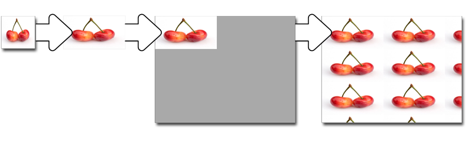

# IXpsOMObjectFactory::CreateImageBrush


## -description

Creates an <a href="/windows/desktop/api/xpsobjectmodel/nn-xpsobjectmodel-ixpsomimagebrush">IXpsOMImageBrush</a> interface.

## -parameters

### -param image [in]

The  <a href="/windows/desktop/api/xpsobjectmodel/nn-xpsobjectmodel-ixpsomimageresource">IXpsOMImageResource</a> interface that contains the image to be used as the source image of the brush.

### -param viewBox [in]

The <a href="/windows/win32/api/xpsobjectmodel/ns-xpsobjectmodel-xps_rect">XPS_RECT</a> structure that defines the <i>viewbox</i>, which is the area  of the source image that is used by the brush.

### -param viewPort [in]

The <a href="/windows/win32/api/xpsobjectmodel/ns-xpsobjectmodel-xps_rect">XPS_RECT</a> structure that defines the <i>viewport</i>, which is the area covered by the first    tile in the output area.

### -param imageBrush [out, retval]

A pointer to the new  <a href="/windows/desktop/api/xpsobjectmodel/nn-xpsobjectmodel-ixpsomimagebrush">IXpsOMImageBrush</a>  interface.

## -returns

The method returns an <b>HRESULT</b>. Possible values include, but are not limited to, those in the table that follows. For information about  XPS document API return values that are not listed in this table, see <a href="/previous-versions/windows/desktop/dd372955(v=vs.85)">XPS Document Errors</a>.

<table>
<tr>
<th>Return code</th>
<th>Description</th>
</tr>
<tr>
<td width="40%">
<dl>
<dt><b>S_OK</b></dt>
</dl>
</td>
<td width="60%">
The method succeeded.

</td>
</tr>
<tr>
<td width="40%">
<dl>
<dt><b>E_POINTER</b></dt>
</dl>
</td>
<td width="60%">
<i>image</i>, <i>viewBox</i>, <i>viewPort</i>, or <i>imageBrush</i> is <b>NULL</b>.

</td>
</tr>
<tr>
<td width="40%">
<dl>
<dt><b>E_INVALIDARG
</b></dt>
</dl>
</td>
<td width="60%">
<i>viewBox</i> or <i>viewPort</i> contains a rectangle or value that is not valid.

</td>
</tr>
</table>

## -remarks

The brush's viewbox specifies the portion of a source image or visual to be used as the tile image.

The coordinates of the brush's viewbox are relative to the source content, such that  (0,0) specifies the upper-left corner of the source content. For images, dimensions specified by the brush's viewbox are expressed in the units of 1/96". The corresponding pixel coordinates in the source image are calculated as follows: 

In the illustration that follows, the image on the left is an example of a source image, and  that on the far right is the brush that results after selecting the viewbox. 


If the source image resolution is 96 by 96 dots per inch and image dimensions are 96 by 96 pixels, the values of fields in the <i>viewbox</i> parameter are as follows:

The preceding parameter values correspond to the  source image as follows:<dl>
<dd>SourceLeft = (96 × 48) / 96  = 48 pixels from the left side</dd>
<dd>SourceTop = (96 × 24) / 96 = 24 pixels from the top</dd>
<dd>SourceWidth = (96 × 24) / 96 = 24 pixels wide</dd>
<dd>SourceHeight = (96 × 48) / 96 = 48 pixels high</dd>
</dl>


An image brush is a tile brush that takes an image, or a part of it,  transforms the image to create a tile, places the resulting tile in the viewport  (the destination geometry of the tile in  the output area), and fills the output area  as described by the tile mode.

The <i>viewport</i> is the area covered by the first tile in the output area. The viewport image is repeated throughout the output area as described by the tile mode.

The next  illustration shows how an image brush is used to fill an output area.  From left to right, the original image is transformed to fill the viewport, then placed in the viewport area of the output area, and then tiled to fill the output area.


The code example that follows illustrates how this method is used to create a new  interface.


```cpp

IXpsOMImageBrush            *newInterface;
// The following values are defined outside of 
// this example.
//  IXpsOMImageResource     *image;
//  XPS_RECT                viewBox;
//  XPS_RECT                viewPort;

// Note the implicit requirement that CoInitializeEx 
//  has previously been called from this thread.

hr = CoCreateInstance(
    __uuidof(XpsOMObjectFactory),
    NULL,
    CLSCTX_INPROC_SERVER,
    _uuidof(IXpsOMObjectFactory),
    reinterpret_cast<LPVOID*>(&xpsFactory)
    );

if (SUCCEEDED(hr))
{
    hr = xpsFactory->CreateImageBrush (
        image,
        &viewBox,
        &viewPort,
        &newInterface);

    if (SUCCEEDED(hr))
    {
        // use newInterface

        newInterface->Release();
    }
    xpsFactory->Release();
}
else
{
    // evaluate HRESULT error returned in hr
}

```

## -see-also

<a href="/windows/desktop/api/xpsobjectmodel/nn-xpsobjectmodel-ixpsomimagebrush">IXpsOMImageBrush</a>


<a href="/windows/desktop/api/xpsobjectmodel/nn-xpsobjectmodel-ixpsomimageresource">IXpsOMImageResource</a>


<a href="/windows/desktop/api/xpsobjectmodel/nn-xpsobjectmodel-ixpsomobjectfactory">IXpsOMObjectFactory</a>


<a href="/windows/desktop/api/xpsobjectmodel/nn-xpsobjectmodel-ixpsomtilebrush">IXpsOMTileBrush</a>


<a href="https://en.wikipedia.org/wiki/Open_XML_Paper_Specification">XML Paper Specification</a>


<a href="/previous-versions/windows/desktop/dd372955(v=vs.85)">XPS Document Errors</a>


<a href="/windows/win32/api/xpsobjectmodel/ns-xpsobjectmodel-xps_rect">XPS_RECT</a>