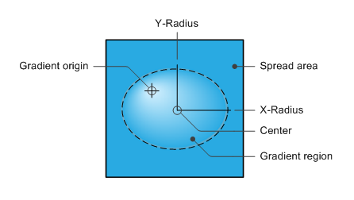

# IXpsOMRadialGradientBrush::GetCenter

## -description

Gets the center point of the radial gradient region ellipse.

## -parameters

### -param center [out, retval]

The x and y coordinates of the center point of the radial gradient region ellipse.

## -returns

The method returns an <b>HRESULT</b>. Possible values include, but are not limited to, those in the table that follows. For information about  XPS document API return values that are not listed in this table, see <a href="/previous-versions/windows/desktop/dd372955(v=vs.85)">XPS Document Errors</a>.

<table>
<tr>
<th>Return code</th>
<th>Description</th>
</tr>
<tr>
<td width="40%">
<dl>
<dt><b>S_OK</b></dt>
</dl>
</td>
<td width="60%">
The method succeeded.

</td>
</tr>
<tr>
<td width="40%">
<dl>
<dt><b>E_POINTER</b></dt>
</dl>
</td>
<td width="60%">
<i>center</i> is <b>NULL</b>.

</td>
</tr>
</table>

## -remarks

The x and y coordinates that are specified in <i>center</i>  are relative to the page and are expressed in units of the transform that is in effect.

The following illustration shows the parts of a radial gradient. <i>center</i> gets the location of the center point of the ellipse that bounds the radial gradient region.  For a more detailed description of this diagram, see <a href="/windows/desktop/api/xpsobjectmodel/nn-xpsobjectmodel-ixpsomradialgradientbrush">IXpsOMRadialGradientBrush</a>.

## -see-also

<a href="/windows/desktop/api/xpsobjectmodel/nn-xpsobjectmodel-ixpsomradialgradientbrush">IXpsOMRadialGradientBrush</a>

<a href="https://en.wikipedia.org/wiki/Open_XML_Paper_Specification">XML Paper Specification</a>

<a href="/previous-versions/windows/desktop/dd372955(v=vs.85)">XPS Document Errors</a>

<a href="/windows/win32/api/xpsobjectmodel/ns-xpsobjectmodel-xps_point">XPS_POINT</a>