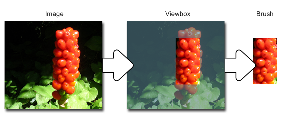

# IXpsOMTileBrush::GetViewbox

## -description

Gets the portion  of the source image to be used by the tile.

## -parameters

### -param viewbox [out, retval]

The <a href="/windows/win32/api/xpsobjectmodel/ns-xpsobjectmodel-xps_rect">XPS_RECT</a> structure that describes the area of the source content to be used by the tile.

## -returns

If the method succeeds, it returns S_OK; otherwise, it returns an <b>HRESULT</b> error code.

<table>
<tr>
<th>Return code</th>
<th>Description</th>
</tr>
<tr>
<td width="40%">
<dl>
<dt><b>S_OK</b></dt>
</dl>
</td>
<td width="60%">
The method succeeded.

</td>
</tr>
<tr>
<td width="40%">
<dl>
<dt><b>E_POINTER</b></dt>
</dl>
</td>
<td width="60%">
<i>viewbox</i> is <b>NULL</b>.

</td>
</tr>
</table>

## -remarks

The brush's viewbox specifies the portion of a source image or visual to be used as the tile image.

The  coordinates of the brush's viewbox are relative to the source content, such that  (0,0) specifies the upper-left corner of the source content. For images, dimensions specified by the brush's viewbox are expressed in the units of 1/96". The corresponding pixel coordinates in the source image are calculated as follows: 

In the illustration that follows, the image on the left is an example of a source image,    the  image in the center shows the selected viewbox,  and the image on the right shows the resulting brush.  

If the source image resolution is 96 by 96 dots per inch and image dimensions are 96 by 96 pixels, the values of fields in the <i>viewbox</i>   parameter would be:

The preceding parameter values correspond to the  source image as:<dl>
<dd>SourceLeft = 96 × 48 / 96  = 48 pixels from the left side</dd>
<dd>SourceTop = 96 × 4  / 96 = 24 pixels from the top</dd>
<dd>SourceWidth = 96 × 24 / 96 = 24 pixels wide</dd>
<dd>SourceHeight = 96 × 48 / 96 = 48 pixels high</dd>
</dl>

## -see-also

<a href="/windows/desktop/api/xpsobjectmodel/nn-xpsobjectmodel-ixpsomtilebrush">IXpsOMTileBrush</a>

<a href="https://en.wikipedia.org/wiki/Open_XML_Paper_Specification">XML Paper Specification</a>

<a href="/windows/win32/api/xpsobjectmodel/ns-xpsobjectmodel-xps_rect">XPS_RECT</a>