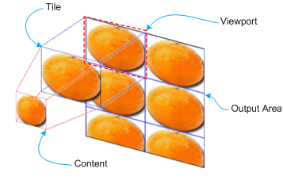

# IXpsOMTileBrush::GetViewport

## -description

Gets the portion of  the destination geometry that is covered by a single tile.

## -parameters

### -param viewport [out, retval]

The <a href="/windows/win32/api/xpsobjectmodel/ns-xpsobjectmodel-xps_rect">XPS_RECT</a> structure that describes the portion of the destination geometry  that is covered by a single tile.

## -returns

If the method succeeds, it returns S_OK; otherwise, it returns an <b>HRESULT</b> error code.

<table>
<tr>
<th>Return code</th>
<th>Description</th>
</tr>
<tr>
<td width="40%">
<dl>
<dt><b>S_OK</b></dt>
</dl>
</td>
<td width="60%">
The method succeeded.

</td>
</tr>
<tr>
<td width="40%">
<dl>
<dt><b>E_POINTER</b></dt>
</dl>
</td>
<td width="60%">
<i>viewport</i> is <b>NULL</b>.

</td>
</tr>
</table>

## -remarks

The viewport is the portion of the output area where the first tile is drawn. In the illustration, the viewport is outlined by the purple rectangle inside the red, dotted rectangle. The tile mode of the brush determines how the rest of the tiles are drawn in the output area.

## -see-also

<a href="/windows/desktop/api/xpsobjectmodel/nn-xpsobjectmodel-ixpsomtilebrush">IXpsOMTileBrush</a>

<a href="https://en.wikipedia.org/wiki/Open_XML_Paper_Specification">XML Paper Specification</a>

<a href="/windows/win32/api/xpsobjectmodel/ns-xpsobjectmodel-xps_rect">XPS_RECT</a>