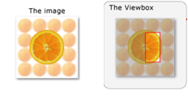

# IXpsOMTileBrush::SetViewbox

## -description

Sets the portion of the source content to be used as the tile image.

## -parameters

### -param viewbox [in]

An <a href="/windows/win32/api/xpsobjectmodel/ns-xpsobjectmodel-xps_rect">XPS_RECT</a> structure that describes the portion of the source content   to be used as the tile image.

## -returns

The method returns an <b>HRESULT</b>. Possible values include, but are not limited to, those in the table that follows. For information about  XPS document API return values that are not listed in this table, see <a href="/previous-versions/windows/desktop/dd372955(v=vs.85)">XPS Document Errors</a>.

<table>
<tr>
<th>Return code</th>
<th>Description</th>
</tr>
<tr>
<td width="40%">
<dl>
<dt><b>S_OK</b></dt>
</dl>
</td>
<td width="60%">
The method succeeded.

</td>
</tr>
<tr>
<td width="40%">
<dl>
<dt><b>E_POINTER</b></dt>
</dl>
</td>
<td width="60%">
<i>viewbox</i> is <b>NULL</b>.

</td>
</tr>
<tr>
<td width="40%">
<dl>
<dt><b>E_INVALIDARG</b></dt>
</dl>
</td>
<td width="60%">
The rectangle described in <i>viewbox</i> was not valid.

</td>
</tr>
</table>

## -remarks

The brush's viewbox specifies the portion of a source image or visual to be used as the tile image.

The coordinates of the brush's viewbox are relative to the source content, such that  (0,0) specifies the upper-left corner of the source content. For images, dimensions specified by the brush's viewbox are expressed in the units of 1/96". The corresponding pixel coordinates in the source image are calculated as follows: 

In the illustration that follows, the image on the left is an example of a source image, while  that on the right is the source image with the selected viewbox for the brush shown as a red rectangle. In this example, the part of the source image that is used as the  content for the tile brush is the area within the red rectangle. The shaded area of the  image is not used by the brush.

If the source image resolution is 96 by 96 dots per inch and image dimensions are 96 by 96 pixels, the values of fields in the <i>viewbox</i>  parameter would be:

The preceding parameter values correspond to the  source image as:<dl>
<dd>SourceLeft = 96 * 48 / 96  = 48 pixels from the left side</dd>
<dd>SourceTop = 96 * 24  / 96 = 24 pixels from the top</dd>
<dd>SourceWidth = 96 * 24 / 96 = 24 pixels wide</dd>
<dd>SourceHeight = 96 * 48 / 96 = 48 pixels high</dd>
</dl>

## -see-also

<a href="/windows/desktop/api/xpsobjectmodel/nn-xpsobjectmodel-ixpsomtilebrush">IXpsOMTileBrush</a>

<a href="https://en.wikipedia.org/wiki/Open_XML_Paper_Specification">XML Paper Specification</a>

<a href="/previous-versions/windows/desktop/dd372955(v=vs.85)">XPS Document Errors</a>

<a href="/windows/win32/api/xpsobjectmodel/ns-xpsobjectmodel-xps_rect">XPS_RECT</a>