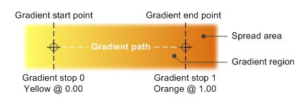

# IXpsOMLinearGradientBrush interface

## -description

Specifies a linear gradient, which is the color gradient along a vector.

## -inheritance

The <b>IXpsOMLinearGradientBrush</b> interface inherits from <a href="/windows/desktop/api/xpsobjectmodel/nn-xpsobjectmodel-ixpsomgradientbrush">IXpsOMGradientBrush</a>. <b>IXpsOMLinearGradientBrush</b> also has these types of members:

## -remarks

In the illustration that follows, the start and end points of a linear gradient are also the start and end points of the gradient path, which is the straight line that connects those points.

The gradient region of a linear gradient is the area between and including the start and end points and extending in both directions at a right angle to the gradient path. The spread area is the area of the geometry that lies outside the gradient region.

Gradient stops are used to define the color at specific locations along the gradient path. In the illustration, gradient stop 0 is located at the start point of the gradient path, and gradient stop 1 is at the end point. The <b>XPS_SPREAD_METHOD_PAD</b> spread method is used to fill the spread area.


The code example that follows illustrates how to create an instance of  this interface.


```cpp

IXpsOMLinearGradientBrush    *newInterface;
// The following values are defined outside of 
// this example.
//  IXpsOMGradientStop       *gradStop1, *gradStop2;
//  XPS_POINT                startPoint, endPoint;

// Note the implicit requirement that CoInitializeEx 
//  has previously been called from this thread.

hr = CoCreateInstance(
    __uuidof(XpsOMObjectFactory),
    NULL,
    CLSCTX_INPROC_SERVER,
    _uuidof(IXpsOMObjectFactory),
    reinterpret_cast<LPVOID*>(&xpsFactory)
    );

if (SUCCEEDED(hr))
{
    hr = xpsFactory->CreateLinearGradientBrush (
        gradStop1,
        gradStop2,
        &startPoint,
        &endPoint,
        &newInterface);

    if (SUCCEEDED(hr))
    {
        // use newInterface

        newInterface->Release();
    }
    xpsFactory->Release();
}
else
{
    // evaluate HRESULT error returned in hr
}

```

## -see-also

<a href="/windows/desktop/api/xpsobjectmodel/nn-xpsobjectmodel-ixpsomgradientbrush">IXpsOMGradientBrush</a>


<a href="/windows/desktop/api/xpsobjectmodel/nn-xpsobjectmodel-ixpsomgradientstop">IXpsOMGradientStop</a>


<a href="/windows/desktop/api/xpsobjectmodel/nf-xpsobjectmodel-ixpsomobjectfactory-createlineargradientbrush">IXpsOMObjectFactory::CreateLinearGradientBrush</a>


<a href="/windows/desktop/api/xpsobjectmodel/nn-xpsobjectmodel-ixpsomradialgradientbrush">IXpsOMRadialGradientBrush</a>


<a href="/previous-versions/windows/desktop/dd316980(v=vs.85)">Interfaces</a>


<a href="https://en.wikipedia.org/wiki/Open_XML_Paper_Specification">XML Paper Specification</a>
